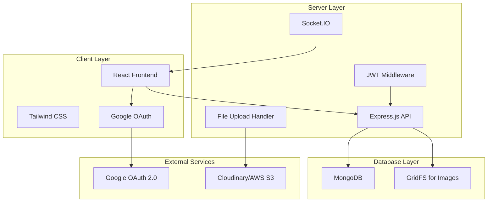

# Design Document

## Overview

The Phone Bid Marketplace is a full-stack web application built with React (frontend), Express.js (backend), and MongoDB (database). The system implements a real-time bidding platform where users can list phones for auction and place bids on available listings. The architecture follows a RESTful API design with real-time capabilities using WebSockets for live updates.

## Architecture

### System Architecture



### Technology Stack

**Frontend:**
- React 19 with Vite
- Tailwind CSS 4 for styling
- React Router for navigation
- Axios for API calls
- Socket.IO client for real-time updates
- React Google OAuth library

**Backend:**
- Express.js 5 with ES modules
- Socket.IO for real-time communication
- JWT for authentication
- Multer for file uploads
- Mongoose for MongoDB ODM
- Bcrypt for password hashing (if needed)
- CORS for cross-origin requests

**Database:**
- MongoDB for primary data storage
- GridFS or cloud storage for image files

## Components and Interfaces

### Frontend Component Structure (client)

```
src/
├── components/
│   ├── common/
│   │   ├── Header.jsx
│   │   ├── Footer.jsx
│   │   ├── LoadingSpinner.jsx
│   │   └── Modal.jsx
│   ├── auth/
│   │   ├── LoginForm.jsx
│   │   ├── GoogleAuthButton.jsx
│   │   └── ProtectedRoute.jsx
│   ├── marketplace/
│   │   ├── ListingCard.jsx
│   │   ├── ListingDetails.jsx
│   │   ├── BidForm.jsx
│   │   └── MarketplaceGrid.jsx
│   ├── dashboard/
│   │   ├── UserDashboard.jsx
│   │   ├── MyListings.jsx
│   │   ├── MyBids.jsx
│   │   └── NotificationPanel.jsx
│   ├── listings/
│   │   ├── CreateListing.jsx
│   │   ├── ListingForm.jsx
│   │   ├── ImageUpload.jsx
│   │   └── BidManagement.jsx
│   └── admin/
│       ├── AdminDashboard.jsx
│       ├── TransactionList.jsx
│       └── TransactionDetails.jsx
├── pages/
│   ├── Home.jsx
│   ├── Marketplace.jsx
│   ├── Dashboard.jsx
│   ├── CreateListing.jsx
│   ├── ListingDetail.jsx
│   └── AdminPanel.jsx
├── hooks/
│   ├── useAuth.js
│   ├── useSocket.js
│   ├── useApi.js
│   └── useNotifications.js
├── services/
│   ├── api.js
│   ├── auth.js
│   ├── socket.js
│   └── storage.js
├── context/
│   ├── AuthContext.jsx
│   ├── SocketContext.jsx
│   └── NotificationContext.jsx
└── utils/
    ├── constants.js
    ├── helpers.js
    └── validators.js
```

### Backend API Structure (server)

```
server/
├── controllers/
│   ├── authController.js
│   ├── listingController.js
│   ├── bidController.js
│   ├── userController.js
│   ├── transactionController.js
│   └── adminController.js
├── models/
│   ├── User.js
│   ├── Listing.js
│   ├── Bid.js
│   ├── Transaction.js
│   └── Notification.js
├── middleware/
│   ├── auth.js
│   ├── validation.js
│   ├── upload.js
│   ├── adminAuth.js
│   └── errorHandler.js
├── routes/
│   ├── auth.js
│   ├── listings.js
│   ├── bids.js
│   ├── users.js
│   ├── transactions.js
│   └── admin.js
├── services/
│   ├── googleAuth.js
│   ├── emailService.js
│   ├── imageService.js
│   └── notificationService.js
├── utils/
│   ├── database.js
│   ├── validators.js
│   ├── helpers.js
│   └── constants.js
├── socket/
│   ├── socketHandlers.js
│   └── socketEvents.js
└── config/
    ├── database.js
    ├── passport.js
    └── multer.js
```

### API Endpoints

**Authentication Routes:**
- `POST /api/auth/google` - Google OAuth authentication
- `POST /api/auth/logout` - User logout
- `GET /api/auth/me` - Get current user profile

**Listing Routes:**
- `GET /api/listings` - Get all active listings
- `GET /api/listings/:id` - Get specific listing details
- `POST /api/listings` - Create new listing
- `PUT /api/listings/:id` - Update listing
- `DELETE /api/listings/:id` - Delete listing
- `GET /api/listings/user/:userId` - Get user's listings

**Bid Routes:**
- `GET /api/bids/listing/:listingId` - Get bids for a listing
- `POST /api/bids` - Place a new bid
- `GET /api/bids/user/:userId` - Get user's bids
- `PUT /api/bids/:id/select` - Select winning bid

**Transaction Routes:**
- `GET /api/transactions` - Get user's transactions
- `GET /api/transactions/:id` - Get transaction details
- `PUT /api/transactions/:id/status` - Update transaction status

**Admin Routes:**
- `GET /api/admin/transactions` - Get all transactions
- `PUT /api/admin/transactions/:id/approve` - Approve transaction
- `PUT /api/admin/transactions/:id/flag` - Flag transaction
- `GET /api/admin/users` - Get all users
- `GET /api/admin/statistics` - Get platform statistics

## Data Models

### User Model
```javascript
{
  _id: ObjectId,
  googleId: String,
  email: String,
  name: String,
  avatar: String,
  role: String, // 'user' | 'admin'
  isActive: Boolean,
  createdAt: Date,
  updatedAt: Date
}
```

### Listing Model
```javascript
{
  _id: ObjectId,
  seller: ObjectId, // Reference to User
  title: String,
  description: String,
  brand: String,
  model: String,
  condition: String, // 'new' | 'like-new' | 'good' | 'fair' | 'poor'
  images: [String], // Array of image URLs
  startingPrice: Number,
  currentHighestBid: Number,
  status: String, // 'active' | 'sold' | 'expired' | 'cancelled'
  auctionEndTime: Date,
  specifications: {
    storage: String,
    color: String,
    screenSize: String,
    battery: String,
    camera: String
  },
  createdAt: Date,
  updatedAt: Date
}
```

### Bid Model
```javascript
{
  _id: ObjectId,
  listing: ObjectId, // Reference to Listing
  bidder: ObjectId, // Reference to User
  amount: Number,
  isWinning: Boolean,
  isSelected: Boolean,
  status: String, // 'active' | 'outbid' | 'winning' | 'selected' | 'rejected'
  createdAt: Date
}
```

### Transaction Model
```javascript
{
  _id: ObjectId,
  listing: ObjectId, // Reference to Listing
  seller: ObjectId, // Reference to User
  buyer: ObjectId, // Reference to User
  winningBid: ObjectId, // Reference to Bid
  amount: Number,
  status: String, // 'pending' | 'approved' | 'completed' | 'cancelled' | 'flagged'
  adminNotes: String,
  createdAt: Date,
  updatedAt: Date
}
```

### Notification Model
```javascript
{
  _id: ObjectId,
  recipient: ObjectId, // Reference to User
  type: String, // 'new_bid' | 'outbid' | 'auction_end' | 'bid_selected' | 'transaction_update'
  title: String,
  message: String,
  relatedListing: ObjectId, // Reference to Listing
  relatedBid: ObjectId, // Reference to Bid
  isRead: Boolean,
  createdAt: Date
}
```

## Error Handling

### Frontend Error Handling
- Global error boundary for React components
- API error interceptors with user-friendly messages
- Form validation with real-time feedback
- Network error handling with retry mechanisms
- Toast notifications for user feedback

### Backend Error Handling
- Centralized error handling middleware
- Custom error classes for different error types
- Input validation using Joi or express-validator
- Database error handling with appropriate HTTP status codes
- Logging system for error tracking and debugging

### Error Response Format
```javascript
{
  success: false,
  error: {
    message: "User-friendly error message",
    code: "ERROR_CODE",
    details: {} // Additional error details if needed
  }
}
```

## Testing Strategy

### Frontend Testing
- **Unit Tests:** Component testing with React Testing Library
- **Integration Tests:** API integration and user flow testing
- **E2E Tests:** Critical user journeys with Cypress or Playwright
- **Visual Tests:** Component visual regression testing

### Backend Testing
- **Unit Tests:** Controller and service function testing with Jest
- **Integration Tests:** API endpoint testing with supertest
- **Database Tests:** Model validation and query testing
- **Security Tests:** Authentication and authorization testing

### Test Coverage Goals
- Minimum 80% code coverage for critical business logic
- 100% coverage for authentication and payment flows
- Performance testing for high-traffic scenarios
- Security testing for vulnerability assessment

## Real-time Communication

### Socket.IO Events

**Client to Server:**
- `join_listing` - Join a specific listing room for updates
- `leave_listing` - Leave a listing room
- `place_bid` - Real-time bid placement

**Server to Client:**
- `new_bid` - Notify about new bids on listings
- `bid_selected` - Notify when a bid is selected
- `auction_ended` - Notify when auction time expires
- `listing_updated` - Notify about listing changes
- `notification` - Send real-time notifications

### WebSocket Connection Management
- Automatic reconnection on connection loss
- Room-based messaging for listing-specific updates
- User authentication for socket connections
- Rate limiting for bid placement to prevent spam

## Security Considerations

### Authentication & Authorization
- Google OAuth 2.0 for secure user authentication
- JWT tokens for session management
- Role-based access control (user/admin)
- Protected routes on both frontend and backend

### Data Security
- Input validation and sanitization
- SQL injection prevention with parameterized queries
- XSS protection with content security policies
- File upload validation and virus scanning
- HTTPS enforcement for all communications

### API Security
- Rate limiting to prevent abuse
- CORS configuration for allowed origins
- Request size limits
- API key validation for admin endpoints
- Audit logging for sensitive operations

## Performance Optimization

### Frontend Optimization
- Code splitting and lazy loading
- Image optimization and lazy loading
- Caching strategies for API responses
- Debounced search and filtering
- Virtual scrolling for large lists

### Backend Optimization
- Database indexing for frequently queried fields
- Connection pooling for database connections
- Caching with Redis for frequently accessed data
- Image compression and CDN integration
- API response pagination

### Database Optimization
- Compound indexes for complex queries
- Aggregation pipelines for analytics
- Data archiving for old transactions
- Regular database maintenance and optimization